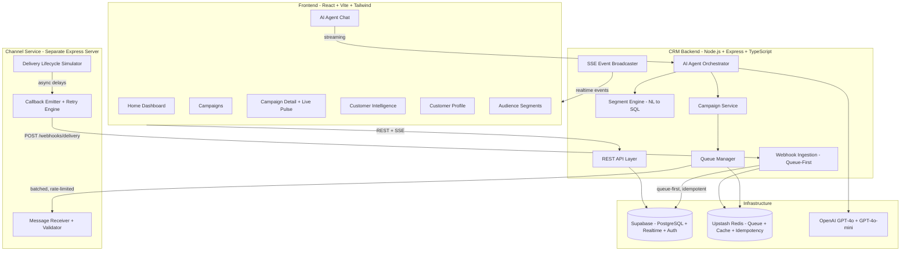
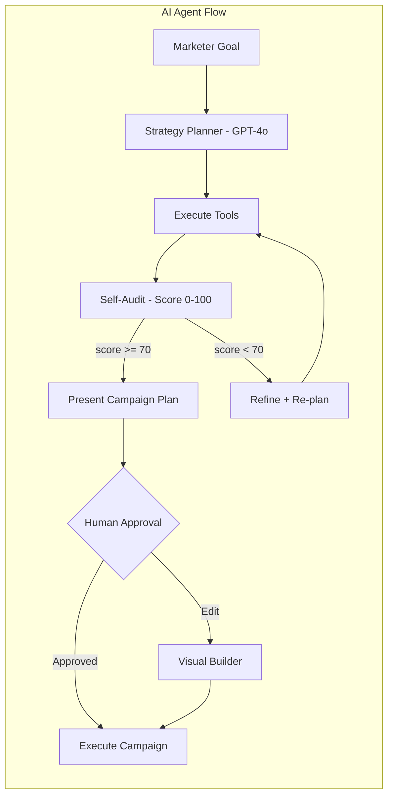
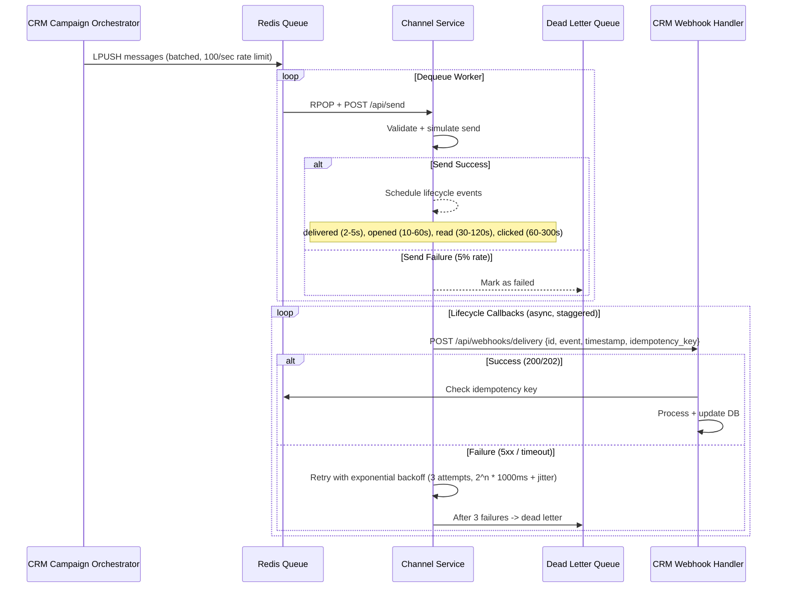
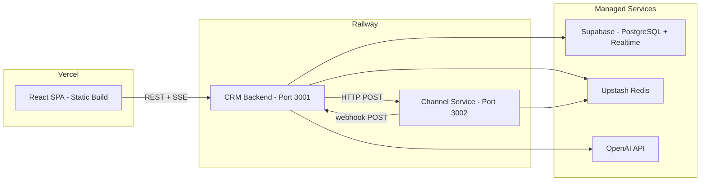

# ReachAI — AI-Native Mini CRM for BrewPulse

## Product Vision

**The Bet:** A hybrid AI Agent + Visual Campaign Platform where the AI operates as a marketing strategist that can autonomously plan, build, and execute campaigns — while the marketer retains full visibility and override control through a beautiful visual interface.

**Brand:** "BrewPulse" — premium coffee chain, 10K+ customers, loyalty program, multi-city, rich purchase behavioral data.

**What Makes This Win:**
- Multi-agent AI with visible reasoning + self-correction (hackathon-winning pattern)
- Event-sourced communication lifecycle (signals senior engineering)
- Real-time delivery pulse with Supabase Realtime (impressive demo)
- Natural language segmentation that generates SQL live
- 7 polished screens (broad) each with AI deeply woven in (deep)

---

## System Architecture



---

## Tech Stack (Final)

- **Frontend:** React 18 + Vite + TypeScript + TailwindCSS + shadcn/ui + Framer Motion + Recharts
- **State:** Zustand (global) + TanStack Query (server state) + Supabase Realtime (live updates)
- **CRM Backend:** Node.js + Express + TypeScript
- **Channel Service:** Node.js + Express + TypeScript (separate deployable)
- **Database:** Supabase PostgreSQL (with RLS, triggers, functions)
- **Queue/Cache:** Upstash Redis (message queue, idempotency store, rate limiter)
- **AI:** OpenAI GPT-4o (planning/strategy) + GPT-4o-mini (message generation, routine)
- **Deployment:** Vercel (frontend) + Railway (CRM backend + Channel Service)
- **Realtime:** Supabase Realtime (Postgres Changes) + Server-Sent Events (agent streaming)

---

## Database Schema (Event-Sourced Design)

```sql
-- ==================== CORE ENTITIES ====================

CREATE TABLE customers (
  id UUID PRIMARY KEY DEFAULT gen_random_uuid(),
  external_id TEXT UNIQUE,
  name TEXT NOT NULL,
  email TEXT,
  phone TEXT,
  city TEXT,
  loyalty_tier TEXT CHECK (loyalty_tier IN ('bronze','silver','gold','platinum')),
  segment_tags TEXT[] DEFAULT '{}',
  preferred_channel TEXT CHECK (preferred_channel IN ('whatsapp','sms','email','rcs')),
  favorite_items JSONB DEFAULT '[]',
  first_purchase_at TIMESTAMPTZ,
  last_purchase_at TIMESTAMPTZ,
  total_orders INTEGER DEFAULT 0,
  total_spent NUMERIC(10,2) DEFAULT 0,
  avg_order_value NUMERIC(10,2) DEFAULT 0,
  days_since_last_order INTEGER GENERATED ALWAYS AS (
    EXTRACT(DAY FROM NOW() - last_purchase_at)
  ) STORED,
  engagement_score NUMERIC(3,2) DEFAULT 0.5,
  created_at TIMESTAMPTZ DEFAULT NOW()
);

CREATE TABLE orders (
  id UUID PRIMARY KEY DEFAULT gen_random_uuid(),
  customer_id UUID REFERENCES customers(id),
  items JSONB NOT NULL,
  total_amount NUMERIC(10,2) NOT NULL,
  store_location TEXT,
  order_date TIMESTAMPTZ NOT NULL,
  payment_method TEXT,
  created_at TIMESTAMPTZ DEFAULT NOW()
);

-- ==================== SEGMENTS ====================

CREATE TABLE segments (
  id UUID PRIMARY KEY DEFAULT gen_random_uuid(),
  name TEXT NOT NULL,
  description TEXT,
  filter_config JSONB NOT NULL,
  natural_language_query TEXT,
  generated_sql TEXT,
  customer_count INTEGER DEFAULT 0,
  created_at TIMESTAMPTZ DEFAULT NOW(),
  updated_at TIMESTAMPTZ DEFAULT NOW()
);

-- ==================== CAMPAIGNS ====================

CREATE TABLE campaigns (
  id UUID PRIMARY KEY DEFAULT gen_random_uuid(),
  name TEXT NOT NULL,
  goal TEXT,
  status TEXT DEFAULT 'draft' CHECK (status IN ('draft','scheduled','running','paused','completed','failed')),
  segment_id UUID REFERENCES segments(id),
  audience_filter JSONB,
  audience_count INTEGER DEFAULT 0,
  channels TEXT[] DEFAULT '{}',
  message_template JSONB,
  ai_reasoning TEXT,
  ai_confidence_score NUMERIC(3,2),
  created_by TEXT DEFAULT 'ai_agent',
  scheduled_at TIMESTAMPTZ,
  started_at TIMESTAMPTZ,
  completed_at TIMESTAMPTZ,
  created_at TIMESTAMPTZ DEFAULT NOW()
);

-- ==================== COMMUNICATIONS (Event-Sourced) ====================

CREATE TABLE communications (
  id UUID PRIMARY KEY DEFAULT gen_random_uuid(),
  campaign_id UUID REFERENCES campaigns(id),
  customer_id UUID REFERENCES customers(id),
  channel TEXT NOT NULL CHECK (channel IN ('whatsapp','sms','email','rcs')),
  message_content TEXT NOT NULL,
  personalization_data JSONB,
  current_status TEXT DEFAULT 'queued' CHECK (current_status IN ('queued','sent','delivered','read','clicked','failed','undelivered')),
  idempotency_key TEXT UNIQUE,
  created_at TIMESTAMPTZ DEFAULT NOW()
);

-- Append-only event log (event sourcing)
CREATE TABLE communication_events (
  id UUID PRIMARY KEY DEFAULT gen_random_uuid(),
  communication_id UUID REFERENCES communications(id),
  event_type TEXT NOT NULL CHECK (event_type IN ('queued','sent','delivered','failed','opened','read','clicked','undelivered')),
  occurred_at TIMESTAMPTZ DEFAULT NOW(),
  metadata JSONB DEFAULT '{}',
  raw_payload JSONB,
  idempotency_key TEXT UNIQUE
);

-- ==================== CAMPAIGN STATS (Trigger-Maintained) ====================

CREATE TABLE campaign_stats (
  campaign_id UUID PRIMARY KEY REFERENCES campaigns(id),
  total_sent INTEGER DEFAULT 0,
  total_delivered INTEGER DEFAULT 0,
  total_failed INTEGER DEFAULT 0,
  total_opened INTEGER DEFAULT 0,
  total_read INTEGER DEFAULT 0,
  total_clicked INTEGER DEFAULT 0,
  total_undelivered INTEGER DEFAULT 0,
  delivery_rate NUMERIC(5,2) DEFAULT 0,
  open_rate NUMERIC(5,2) DEFAULT 0,
  click_rate NUMERIC(5,2) DEFAULT 0,
  updated_at TIMESTAMPTZ DEFAULT NOW()
);

-- ==================== AI AGENT ====================

CREATE TABLE agent_sessions (
  id UUID PRIMARY KEY DEFAULT gen_random_uuid(),
  messages JSONB DEFAULT '[]',
  tool_calls JSONB DEFAULT '[]',
  campaign_id UUID REFERENCES campaigns(id),
  status TEXT DEFAULT 'active',
  created_at TIMESTAMPTZ DEFAULT NOW()
);

-- ==================== POSTGRES TRIGGERS ====================
-- Trigger: on communication_events INSERT -> update campaign_stats
-- Trigger: on communication_events INSERT -> update communications.current_status
-- Trigger: on campaigns status change -> notify realtime subscribers
```

---

## The 7 Screens

### 1. Home Dashboard (Overview)
- Key metrics cards: Total Customers, Active Campaigns, Messages Sent Today, Avg Delivery Rate
- Recent campaign performance sparklines
- AI-suggested actions ("3 segments show declining engagement — want me to draft a win-back?")
- Quick-launch buttons: New Campaign, Ask AI, View Segments

### 2. AI Agent Chat (Hero Feature)
- Full-screen conversational interface with streaming responses
- Visible chain-of-thought (collapsible "thinking" blocks showing agent reasoning)
- Inline rendered cards: audience preview, message draft, channel recommendation, campaign plan
- Self-correction indicator ("Refining plan... confidence: 72% -> 89%")
- Tool call visualization (which tools the agent invoked, with results)
- One-click "Approve & Launch" or "Edit in Builder" buttons on campaign cards
- Persistent session history in sidebar

### 3. Campaigns List
- Card grid of all campaigns with status badges (draft/running/completed)
- Live progress indicators for running campaigns (animated ring charts)
- Filters by status, channel, date range
- Quick stats per campaign (sent/delivered/opened)
- "Create with AI" prominent CTA

### 4. Campaign Detail + Live Delivery Pulse
- Animated funnel: Queued -> Sent -> Delivered -> Opened -> Read -> Clicked
- Real-time counters incrementing as webhooks arrive (Supabase Realtime)
- Per-channel breakdown (side-by-side comparison)
- Communication log table with per-recipient status
- AI-generated insight summary ("WhatsApp delivered 23% faster than SMS for this audience")
- Timeline of campaign lifecycle events

### 5. Customer Intelligence
- Smart data table with inline search, sort, filter
- Segment tags as colored badges
- Loyalty tier distribution visualization
- Customer detail slide-over panel:
  - Purchase history timeline
  - Communication touchpoints
  - Engagement score gauge
  - AI prediction: "likely to churn in 7 days" or "ready for upsell"
- Bulk actions: Add to segment, Send campaign

### 6. Customer Profile (Detail)
- Full customer journey visualization
- Order history with item breakdown
- All campaign communications received + their status
- Engagement score breakdown
- AI-recommended next best action for this customer

### 7. Audience Segments
- Saved segments with customer counts
- Natural language segment builder: type "customers who spent >$50 in the last month and prefer WhatsApp" -> instant preview
- Visual filter builder (AND/OR conditions on any attribute)
- Segment overlap analysis (Venn diagram)
- One-click "Campaign this segment"

---

## AI Agent Architecture (The Differentiator)



**AI Tools (Function Calling):**
1. `query_customers(filter)` — Natural language or structured filter -> SQL -> results
2. `analyze_audience(segment)` — Demographics, behavior patterns, channel preferences
3. `generate_message(context, channel, tone)` — Personalized copy per channel format
4. `recommend_channels(audience)` — Per-customer optimal channel selection
5. `estimate_performance(campaign_config)` — Predict delivery/open/click rates
6. `create_campaign(config)` — Assemble campaign entity
7. `get_past_campaigns(filter)` — Learn from historical performance
8. `launch_campaign(campaign_id)` — Execute after approval

**Self-Correction Loop:**
- After tool execution, agent generates an audit score (0-100)
- Checks: audience size reasonable? Message tone appropriate? Channel mix optimal?
- If score < 70: explains what's wrong, re-plans automatically
- Shows correction to user: "Initially selected 8,000 recipients but narrowed to 2,100 high-intent customers for better ROI"

**Cost-Aware Model Routing:**
- GPT-4o: Strategy planning, audience analysis, self-correction audits
- GPT-4o-mini: Message generation, routine queries, tool parameter construction

---

## Channel Service Architecture (System Design Showcase)



**Design Decisions:**
- **Event-sourced status:** Append to `communication_events`, trigger updates `communications.current_status`
- **Idempotency:** Composite key `{communication_id}:{event_type}` in Redis SET with TTL
- **Ordered transitions:** Validate event ordering (can't "read" before "delivered")
- **Realistic simulation per channel:**
  - WhatsApp: 95% delivery, 75% read, 40% click, fast (2-10s)
  - SMS: 92% delivery, 60% read, 15% click, medium (5-30s)
  - Email: 88% delivery, 35% open, 12% click, slow (30-300s)
  - RCS: 80% delivery, 50% read, 25% click, medium (5-20s)
- **Rate limiting:** Token bucket per channel (configurable)
- **Dead Letter Queue:** Failed messages preserved with full context for debugging

---

## Folder Structure

```
xeno-reach-ai/
├── frontend/
│   ├── src/
│   │   ├── app/                    # App entry, router, providers
│   │   ├── components/
│   │   │   ├── ui/                 # shadcn/ui components
│   │   │   ├── agent/              # AI chat, tool cards, thinking blocks
│   │   │   ├── campaigns/          # Campaign list, detail, funnel
│   │   │   ├── customers/          # Table, profile, timeline
│   │   │   ├── segments/           # Builder, preview, overlap
│   │   │   ├── dashboard/          # Metrics cards, charts, suggestions
│   │   │   └── layout/             # Shell, sidebar, header
│   │   ├── pages/                  # Route-level page components
│   │   ├── hooks/                  # useRealtimeSubscription, useAgent, etc.
│   │   ├── stores/                 # Zustand stores (agent, campaigns, ui)
│   │   ├── services/               # API client (axios instance + endpoints)
│   │   ├── lib/                    # Supabase client, utils, constants
│   │   └── types/                  # Shared TypeScript interfaces
│   ├── public/
│   ├── index.html
│   ├── vite.config.ts
│   ├── tailwind.config.ts
│   ├── tsconfig.json
│   └── package.json
├── backend/
│   ├── src/
│   │   ├── index.ts                # Express server entry
│   │   ├── routes/
│   │   │   ├── customers.ts
│   │   │   ├── orders.ts
│   │   │   ├── campaigns.ts
│   │   │   ├── segments.ts
│   │   │   ├── agent.ts
│   │   │   ├── analytics.ts
│   │   │   └── webhooks.ts
│   │   ├── services/
│   │   │   ├── customer.service.ts
│   │   │   ├── campaign.service.ts
│   │   │   ├── segment.service.ts
│   │   │   ├── analytics.service.ts
│   │   │   └── queue.service.ts
│   │   ├── ai/
│   │   │   ├── orchestrator.ts     # Agent state machine
│   │   │   ├── tools.ts            # Function definitions
│   │   │   ├── prompts.ts          # System prompts
│   │   │   ├── self-correction.ts  # Audit + refine loop
│   │   │   └── model-router.ts     # GPT-4o vs 4o-mini routing
│   │   ├── queue/
│   │   │   ├── producer.ts         # Enqueue campaign messages
│   │   │   ├── consumer.ts         # Dequeue + dispatch to channel service
│   │   │   └── dlq.ts             # Dead letter queue handler
│   │   ├── webhooks/
│   │   │   ├── handler.ts          # Delivery receipt processor
│   │   │   └── idempotency.ts      # Dedup logic
│   │   ├── db/
│   │   │   ├── supabase.ts         # Client initialization
│   │   │   └── queries.ts          # Common query builders
│   │   └── middleware/
│   │       ├── error-handler.ts
│   │       ├── rate-limiter.ts
│   │       └── validator.ts
│   ├── tsconfig.json
│   └── package.json
├── channel-service/
│   ├── src/
│   │   ├── index.ts                # Express server entry
│   │   ├── receiver.ts             # POST /api/send handler
│   │   ├── simulator.ts            # Lifecycle state machine per channel
│   │   ├── callback-emitter.ts     # Webhook POST with retry
│   │   ├── rate-limiter.ts         # Token bucket per channel
│   │   └── config.ts               # Channel-specific parameters
│   ├── tsconfig.json
│   └── package.json
├── tests/                           # Integration + E2E tests
│   ├── setup.ts                    # Test environment setup
│   ├── backend/
│   │   ├── customers.test.ts
│   │   ├── orders.test.ts
│   │   ├── segments.test.ts
│   │   ├── campaigns.test.ts
│   │   └── webhooks.test.ts
│   ├── channel-service/
│   │   ├── receiver.test.ts
│   │   ├── simulator.test.ts
│   │   ├── callback.test.ts
│   │   └── idempotency.test.ts
│   ├── ai/
│   │   ├── orchestrator.test.ts
│   │   ├── tools.test.ts
│   │   ├── self-correction.test.ts
│   │   └── streaming.test.ts
│   ├── integration/
│   │   ├── campaign-loop.test.ts   # Full send→callback→stats loop
│   │   ├── agent-campaign.test.ts  # NL goal → campaign execution
│   │   └── segment-campaign.test.ts
│   └── e2e/
│       ├── demo-scenarios.test.ts  # All 5 demo scenarios
│       └── deploy-smoke.test.ts    # Deployed endpoint health
├── shared/
│   └── types.ts                    # Shared TypeScript types across services
├── scripts/
│   ├── seed.ts                     # 10K customers + 50K orders + 5 campaigns
│   ├── seed-data/
│   │   ├── names.ts               # Realistic Indian names
│   │   ├── menu.ts                # BrewPulse menu items
│   │   └── cities.ts             # Indian cities with distribution
│   └── migrate.sql                # Full schema + triggers + functions
├── docs/
│   ├── ARCHITECTURE.md
│   ├── TRADEOFFS.md
│   └── API.md
├── .env.example
├── package.json                    # Root workspace config
└── README.md
```

---

## Data Seeding (Realistic + Rich)

**10,000 customers** with:
- Realistic Indian names, emails (gmail/outlook), phone numbers (+91)
- Cities: Mumbai, Delhi, Bangalore, Pune, Hyderabad, Chennai (weighted distribution)
- Loyalty tiers: Bronze (50%), Silver (25%), Gold (15%), Platinum (10%)
- Preferred channels distributed realistically
- Engagement scores calculated from order recency/frequency/monetary

**50,000+ orders** with:
- Temporal patterns (morning rush 7-9am, lunch 12-2pm, evening 5-7pm)
- Seasonal variation (iced drinks in summer, hot in winter)
- Menu items from a realistic 40-item menu (drinks, food, combo)
- Price distribution matching a premium coffee chain (Rs 150-600)
- Churn simulation: 30% customers haven't ordered in 30+ days

**5 historical campaigns** with full lifecycle data:
- "Monday Morning Boost" (WhatsApp, running)
- "Loyalty Tier Upgrade" (Email, completed, good performance)
- "Win Back Lapsed Customers" (SMS, completed, mixed results)
- "New Seasonal Menu Launch" (Multi-channel, completed, great performance)
- "Weekend Brunch Special" (RCS, failed — for error state demo)

---

## Scale Assumptions & Tradeoffs

| Decision | Implementation | At Scale (1M+ customers) |
|----------|---------------|--------------------------|
| Message Queue | Upstash Redis LPUSH/RPOP | Kafka with partitioned topics per channel |
| Rate Limiting | Token bucket in Redis | Distributed rate limiter with sliding window |
| Analytics | Postgres triggers -> stats row | ClickHouse + materialized views + CDC |
| Channel Service | Single Express instance | K8s HPA with channel-specific worker pools |
| AI Agent | Synchronous streaming | Async with queue-backed tool execution + caching |
| Realtime | Supabase LISTEN/NOTIFY | Dedicated WebSocket cluster + Redis Pub/Sub |
| Search/Filter | SQL with GIN indexes on JSONB | Elasticsearch with real-time sync |
| Idempotency | Redis SET with TTL | Distributed lock with Redlock algorithm |
| Event Store | Postgres table | Apache Kafka + Postgres (CQRS) |

---

## Deployment Architecture



- **Frontend:** Vercel (auto-deploy from GitHub `main`, preview deploys on PRs)
- **CRM Backend:** Railway (Dockerfile, auto-deploy, 512MB RAM)
- **Channel Service:** Railway (separate service in same project)
- **Database:** Supabase Free (500MB, 2 projects)
- **Redis:** Upstash Serverless (free tier: 10K commands/day — sufficient for demo)
- **AI:** OpenAI API (GPT-4o-mini ~$0.15/1M input tokens — extremely cheap)

---

## Implementation Priority (With Testing + Self-Review + Improvement Cycles)

Every phase follows this mandatory loop:

```
IMPLEMENT → TEST → SELF-REVIEW → SEARCH FOR IMPROVEMENT → IMPLEMENT FIX → VERIFY → DOCS UPDATE
```

### Phase Execution Protocol (Applied After EVERY Phase)

```
1. IMPLEMENT the phase deliverable
2. TEST: Run all test cases (unit + integration + edge cases)
3. SELF-REVIEW (/self-review):
   - Re-read every file modified
   - Check: Does this solve THE thing asked?
   - Bugs: null/undefined, race conditions, unclosed resources?
   - Edge cases: empty input, large input, concurrent access?
   - Types: type-safe, no `any`, generics correct?
   - Error handling: what can throw? Is it caught?
   - Security: input validated? injection possible?
4. SEARCH FOR IMPROVEMENT (/skill-forge):
   - "Is there a better pattern for what I just built?"
   - "What would a staff engineer critique here?"
   - "Does this match the BEST implementations I researched?"
   - Compare against hackathon winners (Serena, AetherSnap, NexusAI)
5. IMPLEMENT IMPROVEMENTS autonomously (don't ask, just fix)
6. RE-TEST after improvements
7. UPDATE DOCS: Reflect any changes in PRD/TRD/ARCHITECTURE.md
8. CHECKPOINT: Can I demo this phase in isolation? Prove it.
```

---

### Phase 1: Scaffold + Schema + Seed

| Deliverable | Dependency |
|-------------|------------|
| Monorepo scaffold, Supabase schema, seed script | None |

**Tests:**
- `seed.test.ts`: Verify 10K customers generated with correct distribution
- `schema.test.sql`: All constraints, triggers, indexes work
- Edge: Empty database handles seed idempotently (re-run doesn't duplicate)
- Edge: Schema handles NULL values in optional fields gracefully
- Edge: Generated `days_since_last_order` computed column is correct

**Self-Review Focus:** Schema design, index coverage, trigger correctness, seed data realism

---

### Phase 2: Backend CRUD + Segment Engine

| Deliverable | Dependency |
|-------------|------------|
| All REST endpoints + NL segmentation | Phase 1 |

**Tests:**
- `customers.test.ts`: CRUD operations, pagination, filtering, bulk import
- `orders.test.ts`: Create, list by customer, date range filtering
- `segments.test.ts`: Filter config → SQL generation, NL → filter parsing
- `campaigns.test.ts`: Create, update status, list with filters
- Edge: Paginate 10K customers without timeout (<200ms)
- Edge: Segment with zero matches returns empty array (not error)
- Edge: NL query with ambiguous input returns reasonable fallback
- Edge: Bulk import with 1 invalid record doesn't fail entire batch
- Edge: SQL injection attempt in segment filter is blocked
- Edge: Concurrent campaign status updates don't race

**Self-Review Focus:** Query performance, SQL injection prevention, error responses

---

### Phase 3: Channel Service (Full Lifecycle)

| Deliverable | Dependency |
|-------------|------------|
| Separate service with simulation + callbacks | Phase 1 |

**Tests:**
- `receiver.test.ts`: Accepts valid payload, rejects malformed (400)
- `simulator.test.ts`: Lifecycle transitions are valid (no skip states)
- `callback.test.ts`: Retry logic fires correctly, respects backoff
- `idempotency.test.ts`: Duplicate callbacks are safely ignored
- `integration.test.ts`: Full loop — send → callbacks received by CRM
- Edge: 1000 concurrent messages don't crash service
- Edge: CRM webhook endpoint down → retries fire, DLQ after 3 failures
- Edge: Out-of-order callbacks are handled (delivered before sent)
- Edge: Extremely fast callbacks (<100ms) still process correctly
- Edge: Channel service restart doesn't lose in-flight messages
- Edge: Invalid communication_id in callback returns 400 (not 500)
- Edge: Rate limiter prevents >100 msg/sec to single channel

**Self-Review Focus:** Distributed system failure modes, retry correctness, data loss scenarios

---

### Phase 4: AI Agent (Tools + Self-Correction + Streaming)

| Deliverable | Dependency |
|-------------|------------|
| Full agent with 8 tools + audit loop + streaming | Phase 2 |

**Tests:**
- `orchestrator.test.ts`: Agent completes 5 canonical scenarios
- `tools.test.ts`: Each tool returns expected shapes, handles errors
- `self-correction.test.ts`: Low-score plans trigger refinement loop
- `model-router.test.ts`: Correct model selected per task type
- `streaming.test.ts`: SSE events arrive in correct order
- Edge: OpenAI API timeout → graceful error message (not crash)
- Edge: Tool returns unexpected format → agent recovers gracefully
- Edge: Self-correction infinite loop prevention (max 3 iterations)
- Edge: Empty customer database → agent says "no data" not hallucinate
- Edge: Very vague goal ("do something") → agent asks for clarification
- Edge: Agent session with 50+ messages doesn't exceed token limit
- Edge: Concurrent agent sessions don't interfere with each other

**Self-Review Focus:** LLM failure handling, token management, loop prevention, response quality

---

### Phase 5: Frontend Shell + Dashboard

| Deliverable | Dependency |
|-------------|------------|
| All routes render, dashboard shows real data | Phase 2 |

**Tests:**
- `layout.test.tsx`: Sidebar renders, navigation works, responsive
- `dashboard.test.tsx`: Metrics load from API, handle loading/error states
- `routing.test.tsx`: All 7 routes render without crash
- Edge: API returns 500 → error boundary shows friendly message
- Edge: Very slow API → loading skeletons show (not blank screen)
- Edge: Zero campaigns/customers → empty states render correctly
- Edge: Browser back/forward navigation works
- Edge: Mobile viewport doesn't overflow horizontally

**Self-Review Focus:** Loading states, error boundaries, accessibility, responsive design

---

### Phase 6: Agent Chat UI (Hero Screen)

| Deliverable | Dependency |
|-------------|------------|
| Streaming chat, campaign cards, approval flow | Phase 4, 5 |

**Tests:**
- `chat.test.tsx`: Message send/receive flow works
- `streaming.test.tsx`: Tokens render incrementally (not all at once)
- `campaign-card.test.tsx`: Approve/Edit buttons trigger correct actions
- `thinking-block.test.tsx`: Collapsible, shows tool calls
- Edge: Very long AI response doesn't break layout
- Edge: Network disconnect mid-stream → graceful error
- Edge: Rapid message sending doesn't duplicate
- Edge: Campaign card with missing fields renders safely
- Edge: Session history with 100+ items scrolls smoothly

**Self-Review Focus:** Streaming UX, error recovery, layout stability, interaction responsiveness

---

### Phase 7: Campaign List + Detail + Live Pulse

| Deliverable | Dependency |
|-------------|------------|
| Campaign screens with real-time delivery tracking | Phase 3, 5 |

**Tests:**
- `campaign-list.test.tsx`: Renders all campaign states correctly
- `campaign-detail.test.tsx`: Funnel shows correct percentages
- `realtime.test.tsx`: Supabase subscription updates counters live
- `funnel.test.tsx`: Animation triggers on data change
- Edge: Campaign with 0 sent messages → funnel shows empty state
- Edge: Campaign with 100% failure rate → shows error prominently
- Edge: Realtime subscription reconnects after disconnect
- Edge: Very large campaign (10K communications) → table virtualizes
- Edge: Navigating away and back preserves subscription

**Self-Review Focus:** Realtime reliability, animation performance, data accuracy

---

### Phase 8: Customer Intelligence + Segments

| Deliverable | Dependency |
|-------------|------------|
| Customer table/profile, NL segment builder | Phase 2, 5 |

**Tests:**
- `customer-table.test.tsx`: Sort, filter, search work correctly
- `customer-profile.test.tsx`: Timeline renders, orders load
- `segment-builder.test.tsx`: NL input → filter preview → save
- `filter-builder.test.tsx`: AND/OR conditions build valid config
- Edge: Customer with 0 orders → profile handles gracefully
- Edge: NL segment query returning 0 results → friendly message
- Edge: Filter with 10+ conditions renders without overflow
- Edge: Customer with very long name/email doesn't break table

**Self-Review Focus:** Table performance (10K rows), filter correctness, NL parsing quality

---

### Phase 9: Integration + Deploy + Polish + Final Verification

| Deliverable | Dependency |
|-------------|------------|
| Live URL, all flows working, documentation complete | All |

**Tests (End-to-End):**
- `e2e-campaign-flow.test.ts`: NL goal → agent plan → approve → execute → webhooks → dashboard updates
- `e2e-segment-campaign.test.ts`: Create segment → campaign → delivery → analytics
- `e2e-channel-loop.test.ts`: 100 messages → all callbacks received → stats accurate
- `deploy-smoke.test.ts`: All deployed endpoints respond with 200
- Edge: Cold start after 5min idle → still responds within 3s
- Edge: Concurrent users (simulated) don't cause data corruption
- Edge: Browser refresh mid-campaign → state preserved correctly
- Edge: OpenAI API key invalid → graceful degradation message

**Final Verification Checklist:**
```
□ All API endpoints return expected shapes (test with curl)
□ Seed script runs cleanly on fresh database
□ Channel service loop completes without data loss (100 msg test)
□ AI agent handles all 5 demo scenarios correctly
□ All 7 screens render without console errors
□ Realtime updates work (launch campaign, watch counters)
□ Mobile responsive (no overflow on iPad)
□ No secrets in committed code (.env.example only)
□ Both Railway services start and accept traffic
□ Vercel build succeeds with zero warnings
□ ARCHITECTURE.md and TRADEOFFS.md are accurate and current
□ README.md has setup instructions that work from scratch
□ Demo scenario can be walked through in <3 minutes
```

---

## Continuous Improvement Protocol (/skill-forge)

After completing phases 2, 4, 7, and 9 (major milestones), run a full improvement cycle:

```
1. COMPARE: Read code against the hackathon winners (Serena architecture, AetherSnap self-correction, NexusAI compliance)
2. IDENTIFY GAPS: What are they doing that I'm not?
3. SEARCH: "Is there a better pattern for [specific concern]?"
4. IMPLEMENT: Fix the top 1-2 improvements immediately
5. DOCUMENT: Update ARCHITECTURE.md with decision rationale
6. RE-TEST: Ensure improvements didn't break existing tests
```

Specific improvement triggers:
- After Phase 2: "Is my segment engine as powerful as Serena's 13-agent query system?"
- After Phase 4: "Does my self-correction loop match AetherSnap's quality gating?"
- After Phase 7: "Is my realtime delivery pulse as impressive as the best dashboards?"
- After Phase 9: "Would this win against the research examples? What's missing?"
