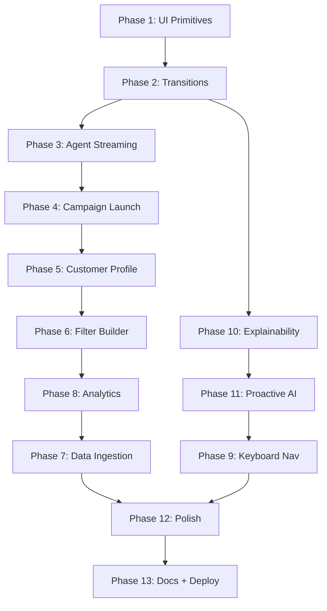

# XenoReach.AI — Full Feature Implementation (Enriched Plan)

## Design Philosophy (Grounded in Research)

From hackathon winner analysis:
- **Serena** won with 13 specialized agents + visible self-correction + WebSocket real-time UI
- **AetherSnap** won with autonomous quality gating (score 0-100, refine if <70)
- **NexusAI** won with real-time agent observability via WebSocket broadcasting
- **Contentr** won with quantifiable business impact (90% time savings)

**Our differentiation strategy:**
1. The AI agent's reasoning is VISIBLE (not a black box) — inspired by Serena
2. Self-correction is SHOWN to the user (confidence score animates) — inspired by AetherSnap
3. Every metric is EXPLAINABLE on hover — signals engineering maturity
4. The delivery pipeline is LIVE (real-time funnel updates) — inspired by NexusAI
5. Campaign results are QUANTIFIED (estimated vs actual) — inspired by Contentr

---

## ENFORCEMENT RULES (Apply to EVERY Phase)

### Rule 1: No Hallucination / No Shortcuts / No Dummy Implementation

```
BEFORE writing any code, verify:
- Does this API endpoint actually exist? (check routes/)
- Does this database column exist? (check migrate.sql)
- Does this npm package export this function? (check node_modules or docs)
- Am I hardcoding data that should come from the API?
- Am I using a placeholder that will never be replaced?

NEVER:
- Write "TODO" or "placeholder" in shipped code
- Use Math.random() to fake data that should come from the DB
- Create a component that renders static text pretending to be dynamic
- Skip error handling because "it's just the happy path for now"
- Leave console.log debugging statements
- Import something that doesn't exist
- Reference an API endpoint that isn't implemented

ALWAYS:
- Wire to real API endpoints
- Handle loading, error, and empty states
- Use real data shapes from shared/types.ts
- Test with actual deployed backend (curl the endpoint first if unsure)
```

### Rule 2: Testing After Every Phase

```
After EACH phase implementation:

1. Run existing tests: npx vitest run
   - All must pass. If any fail, fix before proceeding.

2. Add NEW tests for the phase:
   - Unit tests for new utility functions (in tests/)
   - Integration tests for new API interactions
   - Edge case tests (empty data, error responses, boundary values)
   - Minimum 3 new test cases per phase

3. Verify frontend build: cd frontend && npx vite build
   - Must succeed with zero errors

4. Verify backend compile: cd backend && npx tsc --noEmit
   - Must succeed with zero errors

5. Manual verification:
   - Hit the actual deployed endpoint to confirm it returns expected data
   - Check that new UI components render correctly with real data
```

### Rule 3: Documentation Update After Every Phase

```
After EACH phase, update ALL of the following:

1. AGENTS.md — Add any new learnings, preferences, or gotchas discovered
2. docs/TRD.md — If API shapes changed, update contracts
3. docs/ARCHITECTURE.md — If new architectural decisions were made
4. README.md — If new features are visible to a user
5. This plan file — Mark phase as completed, add notes on what was learned

The docs must ALWAYS reflect the current state of the code.
If a doc says "X" but the code does "Y" — fix the doc immediately.
```

### Rule 4: Learning Loop (From scripts/Prompt.md)

```
After EVERY completed phase, run this loop:

ANALYZE: What worked? What was harder than expected?
CRITIQUE: What would a staff engineer improve? What feels weak?
RESEARCH: Is there a better pattern for what I just built?
IMPROVE: Implement the top 1-2 improvements immediately
VERIFY: Run tests + build + manual check
DOCUMENT: Update docs with new learnings

Only move to the next phase when:
- No obvious improvement remains in the current phase
- All tests pass
- Docs are updated
- The implementation would survive a code review
```

### Rule 5: Infinite Ownership (From Prompt.md)

```
A task is NOT done when code compiles.
A task is NOT done when it renders.
A task is NOT done when tests pass.

A task is DONE when:
✓ It works with REAL data from the DEPLOYED backend
✓ It handles loading state gracefully
✓ It handles error state gracefully
✓ It handles empty state gracefully
✓ Hover states work and add value
✓ Typography and spacing are consistent with the system
✓ A principal engineer would approve without changes
✓ It would impress the Xeno hiring committee
```

---

## Additional Phases (Quality Enforcement)

### Phase 0: Pre-Flight Validation (Run BEFORE starting any other phase)

**Purpose:** Verify the entire system is in a known-good state before making changes.

```
Steps:
1. cd backend && npx tsc --noEmit (zero errors)
2. cd frontend && npx vite build (succeeds)
3. npx vitest run (all 29 tests pass)
4. curl https://xeno-reach-ai-production.up.railway.app/api/health (returns ok)
5. curl https://xeno-reach-ai-production.up.railway.app/api/customers?page_size=1 (returns data)
6. Open frontend URL in browser — all 7 pages render with data
```

If ANY step fails → fix it BEFORE starting new work.

### Phase 14: Integration Test Suite (After all feature phases)

**Purpose:** Comprehensive end-to-end validation that the full system works together.

**Tests to write:**
- `tests/e2e/full-flow.test.ts`: Simulate full campaign lifecycle (create → launch → callbacks → stats)
- `tests/e2e/agent-flow.test.ts`: Agent creates campaign from NL goal (mock OpenAI response)
- `tests/e2e/segment-flow.test.ts`: Create segment → preview → campaign
- `tests/integration/channel-loop.test.ts`: 50 messages sent → all callbacks received → stats accurate
- `tests/frontend/pages.test.ts`: All 7+ pages render without throwing (React Testing Library)

### Phase 15: Performance and Accessibility Audit

**Purpose:** Ensure the product meets production quality standards.

**Performance:**
- Lighthouse score > 80 on all pages
- Bundle size audit (identify largest chunks, lazy-load if >200KB)
- API response time: all endpoints < 3s with 10K customers
- No memory leaks in Realtime subscriptions (proper cleanup in useEffect)

**Accessibility:**
- All interactive elements have focus indicators
- Color contrast: 4.5:1 minimum (verify with browser devtools)
- Screen reader: all images have alt text, all buttons have labels
- Keyboard: Tab through all interactive elements, Escape closes modals

### Phase 16: Security Review

**Purpose:** Ensure no secrets leaked, no injection vectors.

**Checks:**
- `.env` is in `.gitignore` (never committed)
- No API keys in frontend code (only VITE_SUPABASE_ANON_KEY which is public)
- SQL injection: all queries use parameterized inputs (via REST API)
- XSS: React auto-escapes, but verify no dangerouslySetInnerHTML
- CORS: backend only accepts requests from known frontend domains
- Webhook secret validation on all callback endpoints

### Phase 17: Final Self-Critique and Improvement Sprint

**Purpose:** One last pass as Principal Engineer + Staff Designer + Investor.

```
Ask yourself:
1. Would I invest in this product based on the demo?
2. What's the ONE thing that would make a judge say "wow"?
3. Is there any screen that feels "unfinished" or "placeholder"?
4. Does the AI experience feel genuinely intelligent or like a wrapper?
5. Would a senior engineer at Xeno approve this codebase?
6. Is the video walkthrough story clear from just using the product?

If any answer is unsatisfying → implement the fix.
Repeat until all answers are "yes."
```

---

## Phase 1: UI Primitive Library

**Why first:** Every subsequent phase depends on consistent, reusable components. Building these once prevents inconsistency later.

### Components to Build:

**Toast.tsx** — Stack-based notifications
- Position: bottom-right
- Types: success/error/info/warning
- Auto-dismiss: 4s with progress bar
- Dismissable with X button
- Framer Motion slide-in/out animation
- Usage: campaign launch success, API errors, segment saved

**Skeleton.tsx** — Animated loading placeholders
- Variants: line, card, table-row, metric
- Pulsing animation (opacity 0.3 → 0.7)
- Matches exact dimensions of real content
- Usage: Dashboard metrics, campaign list, customer table

**EmptyState.tsx** — Friendly empty views
- Props: icon, title, description, actionLabel, actionLink
- Centered layout with muted icon
- Primary action button
- Usage: No campaigns, no segments, no search results

**Modal.tsx** — Confirmation dialogs
- Backdrop blur + fade
- Centered card with title/body/actions
- Escape to close, click-outside to close
- Usage: Campaign launch confirmation, delete segment

**Tooltip.tsx** — Hover explanations
- Appears on hover with 200ms delay
- Positioned above element (with viewport detection)
- Max-width 250px, small text
- Usage: Metric explanations, tier descriptions, status meanings

---

## Phase 2: Page Transitions and Micro-interactions

**Why:** The current app feels static. Pages just "appear." Adding motion creates perceived quality.

### Implementation:
- Wrap `<Outlet />` in `<AnimatePresence mode="wait">`
- Each page exports a motion wrapper: `initial={{ opacity: 0, y: 8 }}` → `animate={{ opacity: 1, y: 0 }}`
- Duration: 200ms, easing: `[0.25, 0.46, 0.45, 0.94]`
- Stagger children on data load (metrics cards appear 1-2-3-4 sequentially)

### Hover states audit:
- All table rows: `hover:bg-bg-2` + row highlight
- All cards/panels: `hover:border-border` (brighten border)
- All buttons: `hover:-translate-y-px hover:shadow-sm`
- All links: `hover:text-accent` underline offset animation
- Campaign cards: subtle scale(1.005) on hover
- Sidebar nav items: left-border slide-in on active

---

## Phase 3: Agent SSE Streaming UX (Hero Feature)

**Why critical:** The agent chat is the DEMO MOMENT. It must feel magical, not like waiting for an API call.

### Token-by-Token Streaming:
- Switch from POST /agent/chat to POST /agent/chat/stream (SSE)
- Frontend reads stream with `ReadableStream` reader
- Each `token` event appends to message with blinking cursor
- Typing speed: real-time (as tokens arrive from Azure OpenAI)

### Live Tool Call Visibility:
- When `tool_start` event arrives: show tool card with spinner
- Card shows: tool name + brief description of what it does
- When `tool_end` arrives: spinner → checkmark, show result summary
- Example: "query_customers → Found 2,100 matching customers"

### Self-Correction Display:
- When agent runs self-audit: show "Evaluating plan quality..."
- Confidence badge appears and animates: "72%" → "89%" (if self-correction triggered)
- Show brief note: "Narrowed audience from 8,000 to 2,100 for better ROI"

### Campaign Card (Inline):
- Renders when `create_campaign` tool returns
- Shows: name, audience count, channel, message preview (truncated)
- Estimated metrics: delivery rate, open rate, click rate (from estimate_performance tool)
- Two buttons: "Launch Now" (gradient, primary) and "View Details" (outline, secondary)

---

## Phase 4: Campaign Launch Experience

### Pre-Launch Confirmation Modal:
- Triggered by "Launch" button (on campaign detail OR agent chat card)
- Shows: audience count, channel, message preview, estimated performance
- Warning if audience > 5000: "Large campaign — are you sure?"
- Two buttons: "Cancel" and "Launch Campaign" (with rocket icon)

### Post-Launch Flow:
- Toast: "Campaign launched! Sending to {count} recipients..."
- Redirect to campaign detail page
- Funnel starts at 0 and increments live

### Live Supabase Realtime:
- Frontend subscribes to `campaign_stats` table filtered by campaign_id
- On each Postgres Change event: update funnel numbers with spring animation
- Each number "pops" briefly when it changes (scale 1.1 → 1.0)

### Campaign Completion:
- Backend: after all communications reach final status, update campaign to "completed"
- Frontend: when status changes to "completed", show success state
- Confetti-style celebration? Or just a clean "Completed" badge transition

---

## Phase 5: Customer Profile Page

### Route: `/customers/:id`

### Sections:

**Header:**
- Name, email, phone, city
- Loyalty tier badge (with color + description on hover)
- Engagement score gauge (circular SVG)
- "Send Campaign" quick action button

**Order Timeline:**
- Vertical timeline, most recent first
- Each node: date, items list, total amount, store location
- Color intensity increases with order value
- Shows: "12 orders in last 6 months" summary

**Communication History:**
- All campaigns this customer was part of
- Channel icon + campaign name + status badge + date
- Hover to see message content preview

**AI Predictions Panel:**
- Churn risk: "High / Medium / Low" with days estimate
- Upsell readiness: score 0-100 with recommendation
- Next best action: "Send WhatsApp with 15% off" (specific, actionable)
- "Why this prediction?" expandable section explaining the signals

**Favorite Items:**
- Display from `favorite_items` field
- Show as small badges/chips

---

## Phase 6: Visual Segment Filter Builder

### UI Design:
- Split view: filter builder on left, audience preview on right
- Each condition is a row: [Field dropdown] [Operator dropdown] [Value input]
- "Add condition" button adds a row
- AND/OR toggle between conditions
- "Remove" X button per condition

### Field Options:
- city (dropdown: Mumbai, Delhi, Bangalore, Pune, Hyderabad, Chennai)
- loyalty_tier (dropdown: bronze, silver, gold, platinum)
- total_spent (number input with gt/lt/between operators)
- total_orders (number input)
- engagement_score (slider 0-100)
- preferred_channel (dropdown)
- last_purchase_at (date picker or "inactive for X days")

### Live Preview:
- Debounced (300ms) after each condition change
- Calls POST /segments/preview with current filter_config
- Shows: "{count} customers match" + sample table (5 rows)
- Updates in real-time as you adjust conditions

### Save + Campaign:
- "Save Segment" button → name input → saves
- "Campaign This Audience" → navigates to agent chat pre-filled

---

## Phase 7: Data Ingestion UI

### Customers Import:
- Button on Customers page: "Import Data"
- Opens modal with:
  - Textarea for JSON paste (array of customer objects)
  - OR file upload (.json)
  - Format guide/example shown
- "Import" button → calls POST /customers/bulk
- Progress indicator during upload
- Result: "Imported 500 customers, 3 errors (duplicates)"

### Orders Import:
- Similar flow on Orders section
- Requires customer_id references to exist

---

## Phase 8: Analytics Intelligence

### Channel Comparison Enhanced:
- Each bar in the chart has hover tooltip:
  - "WhatsApp: 95% delivery — high due to direct device push"
  - "Email: 88% delivery — lower due to spam filters"
- Below chart: AI-generated text explaining the key takeaway

### Campaign Trend (if 3+ campaigns):
- Simple line chart showing delivery_rate over time (x-axis: campaign date)
- Trend indicator: "Improving ↑" or "Declining ↓" badge

### AI Insights Panel:
- After loading data, generate 2-3 insights:
  - "WhatsApp outperforms SMS by 2.7x in open rate for this audience"
  - "Gold tier customers have 89% open rate — focus campaigns here"
  - "30% of bronze tier is churning — win-back campaign recommended"
- These are computed from actual data (not hardcoded)

---

## Phase 9: Keyboard Navigation

### Cmd+K Command Palette:
- Global listener for Cmd+K (Mac) / Ctrl+K (Windows)
- Opens centered modal with search input
- Options: "Go to Dashboard", "Go to Customers", "Create Campaign", "Find Customer: {name}"
- Type to filter, Enter to select, Esc to close

### Page Navigation:
- When no input is focused: keys 1-6 navigate between pages
- Shows keyboard hints in sidebar (already in design)

### Escape:
- Closes: command palette, modals, customer slide-over, expanded tool calls

---

## Phase 10: Explainability Layer

### Every metric gets a tooltip:
- "Total Customers" → "Active customer profiles in the BrewPulse database"
- "Delivery Rate" → "Percentage of sent messages that reached the recipient's device"
- "Open Rate" → "Percentage of delivered messages that were opened/viewed by recipient"
- "Engagement Score" → "Composite score (0-100) based on order recency, frequency, and monetary value"

### Every status badge is explainable:
- "queued" → "Message waiting to be sent to channel service"
- "sent" → "Dispatched to channel provider, awaiting delivery confirmation"
- "delivered" → "Successfully reached recipient's device"
- "failed" → "Could not reach recipient — reason shown in details"

### AI decisions show "why":
- Campaign confidence score: hover shows breakdown (audience 22/25, channel 18/20, message 20/25...)
- Channel recommendation: "WhatsApp selected because 73% of this audience prefers it and it has 95% delivery rate"

---

## Phase 11: Proactive AI Suggestions

### Dashboard Integration:
- After overview data loads, compute 2-3 suggestions:
  1. Churning segment: "{N} customers haven't ordered in 30+ days — win-back opportunity"
  2. High-value untapped: "{N} platinum customers not contacted this month"
  3. Channel optimization: "SMS campaigns underperforming — switch to WhatsApp for 2.5x better open rate"

### Each Suggestion:
- Card with gradient left-border (accent)
- Icon + short insight text
- "Plan with AI →" link that pre-fills agent chat input

### Data-Driven (Not Hardcoded):
- Compute from actual query results at render time
- Show different suggestions based on what the data reveals

---

## Phase 12: Visual Polish Pass

### Spacing Audit:
- Consistent 4px grid (p-1 = 4px, p-2 = 8px, p-3 = 12px, p-4 = 16px, p-5 = 20px)
- Section gaps: 16-20px between panels
- Header height: exactly 48px everywhere

### Typography Hierarchy:
- Page title: text-md (14px) font-semibold
- Section headers: text-xs (11px) font-semibold
- Body text: text-sm (12px) regular
- Data values: font-mono text-sm
- Muted labels: text-2xs (10px) text-txt-4 uppercase tracking-wider

### Color Accessibility:
- Verify all text meets 4.5:1 contrast against bg-0/bg-1/bg-2
- Test semantic colors (green/red/amber) against dark backgrounds
- Ensure accent color (indigo) is readable on all surfaces

### Responsive:
- Sidebar collapses to icons at < 1024px
- Tables become scrollable on small screens
- Modals are max-width constrained

### Performance:
- Lazy-load Analytics page (has heavy Recharts)
- Code-split customer profile route
- Preload critical routes on hover

---

## Phase 13: Documentation Sync

### Files to Update:
- README.md: final deployed URLs, accurate architecture diagram
- ARCHITECTURE.md: document REST client decision (replaced Supabase JS), new frontend components
- TRD.md: update API response shapes if any changed
- AGENTS.md: capture any new learnings
- PRD.md: mark P0 features as complete, note P1/P2 status

### Final Deploy:
- Run full test suite
- Build frontend + verify
- Push to GitHub
- Deploy to Vercel (--prod)
- Verify live URLs work end-to-end
- Health check backend

---

## Execution Priority (Demo Impact Ordered)



**Critical path for demo:** Phase 1 → 2 → 3 → 4 → 10 → 11 (these make the demo "pop")
**Feature completeness:** Phases 5-9 fill out the product surface area
**Ship quality:** Phases 12-13 ensure it's production-grade

---

## SESSION CONTEXT (For Continuation in New Chat)

### Project Identity
- **Product:** XenoReach.AI — AI-native Mini CRM for BrewPulse (premium coffee chain, India)
- **Assignment:** Xeno Engineering Internship 2026 — Due June 15, 2026 12:00 PM IST
- **GitHub:** `Adit-Jain-srm/xeno-reach-ai`
- **Key documents:** `AGENTS.md` (workspace memory), `docs/PRD.md`, `docs/TRD.md`, `docs/ARCHITECTURE.md`

### Current Deployment (All Working)
- **Frontend:** Vercel — Latest: `https://xeno-reach-dc1n3okrt-aj5.vercel.app` (scope: `aj5`)
- **Backend:** Railway — `https://xeno-reach-ai-production.up.railway.app` (Root Dir: `backend`)
- **Channel Service:** Railway — `https://surprising-respect-production-5c4f.up.railway.app` (Root Dir: `channel-service`)
- **Database:** Supabase — ref `fezjpfcrikzirfypjjcp`, 10K customers + 50K orders seeded, migration run
- **Backend health:** `/api/health` returns `{ supabase: true, azure_openai: true }`

### Tech Stack (Exact Versions That Work)
- Frontend: React 18 + Vite 8 + TypeScript + Tailwind 3 + Framer Motion + Recharts + react-router-dom@6
- Backend: Express + TypeScript + tsx runtime (no tsc build step — `node --import tsx src/index.ts`)
- AI: Azure OpenAI — endpoint `https://aditjain2005-0132-resource.openai.azure.com`, deployment `gpt-4o`, API version `2025-01-01-preview`
- Database: Custom REST client (NOT @supabase/supabase-js — that hangs on Node 20 due to WebSocket). Direct fetch to PostgREST at `{SUPABASE_URL}/rest/v1/`
- Channel Service: Standalone Express, simulates delivery lifecycle with exponential backoff callbacks

### Critical Architecture Decisions Made This Session
1. **Replaced Supabase JS client with direct REST API** — `backend/src/db/supabase.ts` is a custom `QueryBuilder` class that calls PostgREST via `fetch()`. The `@supabase/supabase-js` client HANGS on Node 20 Railway because its Realtime WebSocket initialization blocks all operations.
2. **Agent uses Azure OpenAI with `AzureOpenAI` class from `openai` package** — configured in `backend/src/ai/orchestrator.ts`
3. **Vercel deployment uses `.env.production` file** in `frontend/` for `VITE_API_URL` and `VITE_SUPABASE_*` vars (inline buildCommand has 256 char limit)
4. **Railway services use Nixpacks auto-detect** — no Dockerfile, no railway.json. Just `package.json` with `"start"` script. Root Directory set per service in Railway dashboard.
5. **Backend has 15s request timeout middleware** — prevents Supabase query hangs from blocking indefinitely
6. **Session memory persisted in `agent_sessions` table** — frontend shows session list in sidebar, loads history on click
7. **Agent system prompt forces `create_campaign` tool call** — ensures campaign card appears in UI

### Design Direction (User-Corrected Preferences)
- **Bloomberg Terminal meets Linear.app** — data-dense, information-first
- REJECTED: glass morphism, gradient meshes, decorative elements (felt "AI template")
- Later OVERRIDDEN: User said "override my previous restricting/limiting preferences" — now wants MORE visual richness
- Current state: Compact panels + gradient accent buttons + progress rings + animated numbers + tool call cards
- Typography: Satoshi (headings) + JetBrains Mono (data), 13px base
- Color: semantic-only (green/red/amber/blue) + indigo accent with gradient-to-purple for CTAs
- Sidebar: 200px, 48px headers, `panel` class for surfaces

### File Structure (Current)
```
frontend/src/
  App.tsx                       # Router (react-router-dom v6)
  main.tsx                      # Providers (QueryClient, BrowserRouter)
  index.css                     # Design tokens + Tailwind config
  components/layout/Shell.tsx   # App shell (sidebar + outlet)
  components/layout/Sidebar.tsx # 200px nav with keyboard hints
  hooks/useRealtime.ts          # Supabase Realtime (for frontend only)
  lib/cn.ts                     # clsx + tailwind-merge
  lib/supabase.ts               # Frontend Supabase client (anon key)
  services/api.ts               # Axios client to Railway backend
  stores/index.ts               # Zustand (agent state, UI state)
  pages/Dashboard.tsx           # Metrics + campaigns + channel bars + AI insight
  pages/AgentChat.tsx           # Session sidebar + chat + tool cards + campaign card
  pages/Campaigns.tsx           # Table with status badges
  pages/CampaignDetail.tsx      # Funnel + communications log + AI reasoning
  pages/Customers.tsx           # Table + slide-over panel + AI predictions
  pages/Segments.tsx            # NL builder + saved segments list
  pages/Analytics.tsx           # Recharts bar charts + AI insight

backend/src/
  index.ts                      # Express server + health + diag + timeout middleware
  db/supabase.ts                # Custom REST QueryBuilder (NOT supabase-js)
  ai/orchestrator.ts            # AzureOpenAI + processAgentMessage + streaming generator
  ai/prompts.ts                 # System prompt (forces create_campaign) + self-audit prompt
  ai/tools.ts                   # 8 OpenAI function calling tool definitions
  ai/tool-executor.ts           # Executes tools against DB (query_customers, etc.)
  routes/agent.ts               # POST /chat, POST /chat/stream (SSE), GET /sessions
  routes/campaigns.ts           # CRUD + POST /:id/launch
  routes/customers.ts           # CRUD + GET /:id/timeline
  routes/segments.ts            # CRUD + POST /preview + POST /natural-language
  routes/webhooks.ts            # POST /delivery (idempotent, ordered status transitions)
  routes/analytics.ts           # GET /overview, GET /channels
  routes/orders.ts              # CRUD + bulk
  services/campaign.service.ts  # launchCampaign dispatches to channel service via queue
  services/segment.service.ts   # Filter-to-SQL, applyFilters, buildFilterSQL
  queue/producer.ts             # In-memory queue with batch dispatch + rate limiting

channel-service/src/
  index.ts                      # Receives messages, simulates lifecycle, fires webhook callbacks
```

### Hackathon Research Findings (Key Differentiation Patterns)
- **Serena (Google ADK winner):** 13 agents + self-correcting SQL + WebSocket real-time UI
- **AetherSnap (Gemini winner):** Autonomous self-correction loop (score 0-100, refine if <70)
- **NexusAI:** Real-time agent observability broadcasting via WebSocket
- **Contentr:** Quantifiable business impact (90% time savings)
- **Key judge criteria:** Technical Execution (50%) > Value/Impact (20%) > Creativity (10%) > Functionality (10%) > Demo Quality (10%)

### What's Already Working
- 10,000 customers in DB with realistic Indian data (names, cities, loyalty tiers, purchase history)
- 5 historical campaigns with full delivery lifecycle data
- AI agent with 8 function-calling tools that creates real campaigns
- Channel service with realistic per-channel delivery rates (WhatsApp 95%, SMS 92%, Email 88%, RCS 80%)
- Two-service callback loop: CRM → Channel → Webhook → Event-sourced status → Trigger → Stats
- Session persistence: conversations saved and loadable
- Frontend with 7 screens, all connected to live backend

### What Needs Implementation (This Plan)
- Phase 1-13 above (UI primitives through final polish)
- The "life" factor: animations, transitions, hover states, tooltips, proactive AI
- Missing features: Customer Profile page, Visual Filter Builder, Data Ingestion UI, Keyboard shortcuts
- Streaming agent UX (currently non-streaming; SSE endpoint exists but frontend uses sync)

### Deploy Commands (For Reference)
```powershell
# Frontend deploy
cd "c:\Users\aditj\New Projects\xeno-reach-ai"
npx vercel --yes --prod --scope aj5 --public

# Push to GitHub (auto-deploys Railway)
git add -A && git commit -m "message" && git push

# Run tests
npx vitest run

# Build check
cd frontend && npx vite build

# Backend type check
cd backend && npx tsc --noEmit
```

### Environment Variables (Railway Backend)
```
PORT=3001
SUPABASE_URL=https://fezjpfcrikzirfypjjcp.supabase.co
SUPABASE_SERVICE_KEY=eyJ...(219 chars)
SUPABASE_ANON_KEY=eyJ...
AZURE_OPENAI_ENDPOINT=https://aditjain2005-0132-resource.openai.azure.com
AZURE_OPENAI_API_KEY=1284G7PB...
AZURE_OPENAI_DEPLOYMENT=gpt-4o
AZURE_OPENAI_API_VERSION=2025-01-01-preview
WEBHOOK_SECRET=reachai-webhook-secret-2026
CHANNEL_SERVICE_URL=https://surprising-respect-production-5c4f.up.railway.app
```

### Key Gotchas (Learned the Hard Way)
1. `@supabase/supabase-js` HANGS on Node 20 Railway — use direct REST API instead
2. Vercel `buildCommand` has 256 char limit — use `.env.production` file
3. `react-router-dom@7` removed `BrowserRouter` — must use v6
4. Vercel Deployment Protection must be disabled manually in dashboard for public access
5. Railway needs Root Directory set explicitly (`backend` / `channel-service`)
6. `react-is` must be explicitly installed (recharts peer dep)
7. `--legacy-peer-deps` needed for Vercel npm install (vite version conflict with vitest)
8. PowerShell: no heredocs, no `&&` chaining (use `;` or separate commands)
9. Azure OpenAI: only `gpt-4o` deployment works; `gpt-4o-mini` and `gpt-5.3-chat` return 404/400
