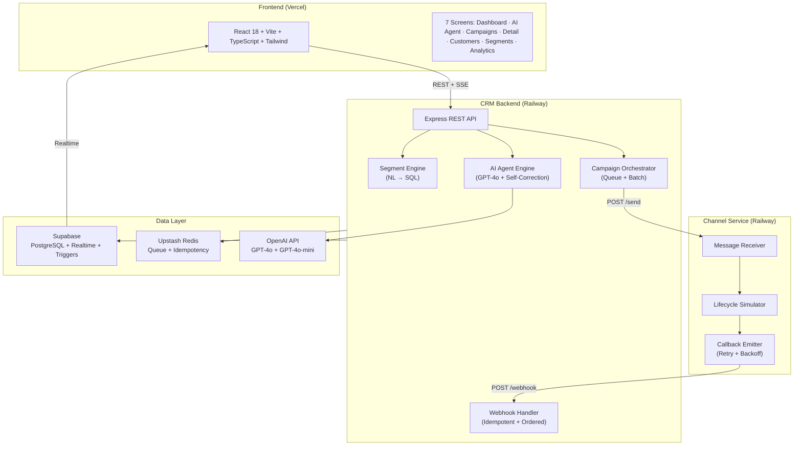
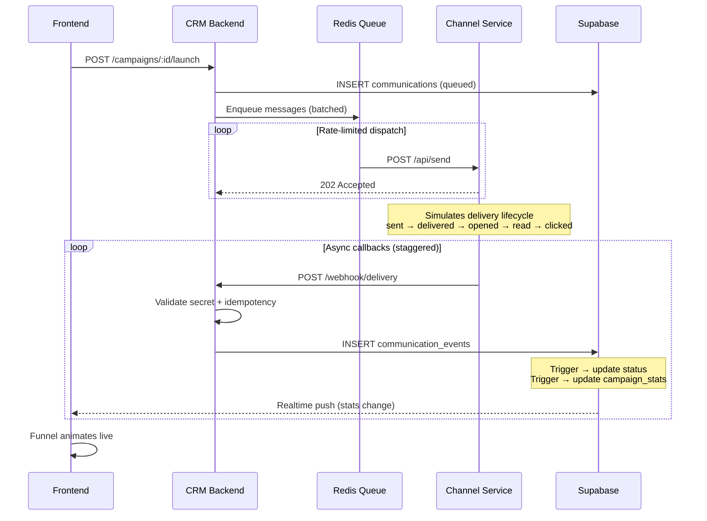
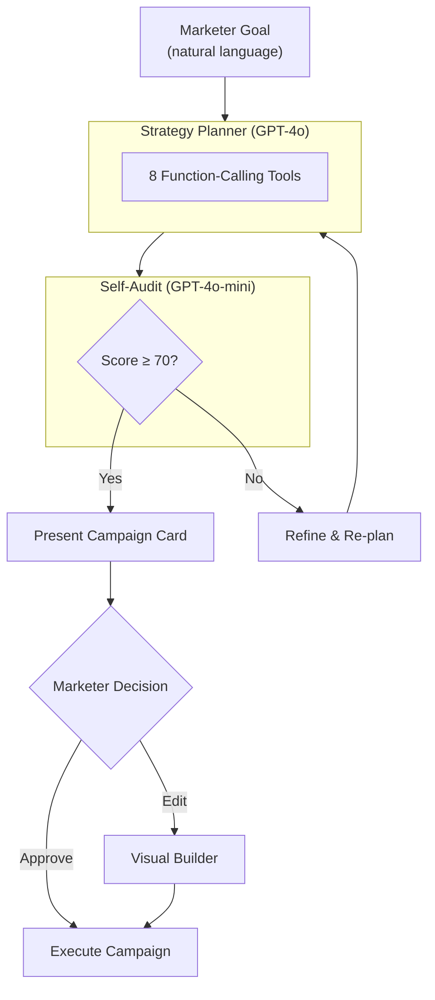

# ReachAI — AI-Native Mini CRM

> **An AI agent that autonomously plans and executes marketing campaigns for BrewPulse, a premium coffee chain.**

ReachAI is built around a single bold bet: the AI agent **is** the primary interface. Marketers describe a business goal in natural language, and the agent analyzes 10,000+ customers, recommends audiences, drafts personalized messages, selects optimal channels, and executes — all with visible reasoning and self-correction.

---

## Architecture



---

## What Makes This Different

| Feature | Why It Matters |
|---------|---------------|
| **AI Agent with Self-Correction** | Agent audits its own plan (0-100 score), refines until quality threshold met. Inspired by [AetherSnap](https://devpost.com/software/aethersnap). |
| **Event-Sourced Communications** | Append-only event log + Postgres triggers = handles out-of-order webhooks, full audit trail, zero data loss. |
| **Two-Service Callback Loop** | CRM → Channel Service → webhook callbacks. Retry with exponential backoff, idempotency keys, dead letter queue. |
| **Live Delivery Pulse** | Supabase Realtime subscriptions make the campaign funnel animate live as webhooks arrive. |
| **Visible Chain of Thought** | Agent shows which tools it called, what it found, and why it made each decision. Not a black box. |
| **Streaming SSE + Context-Aware** | Token-by-token streaming via Server-Sent Events. Agent auto-injects recent campaign performance and customer base stats into its reasoning context. |
| **Smart Channel Routing** | Per-customer channel selection based on preference and engagement data — not blast-all. |

---

## Quick Start

```bash
# Clone
git clone https://github.com/Adit-Jain-srm/xeno-reach-ai.git
cd xeno-reach-ai

# Install
npm install

# Configure
cp .env.example .env
# Fill in: SUPABASE_URL, SUPABASE_SERVICE_KEY, OPENAI_API_KEY

# Database setup
# Run scripts/migrate.sql in Supabase SQL Editor

# Seed data (10K customers, 50K orders, 5 campaigns)
npm run seed

# Run all services
npm run dev
# Frontend: http://localhost:5173
# Backend:  http://localhost:3001
# Channel:  http://localhost:3002
```

---

## Tech Stack

| Layer | Technology | Why |
|-------|-----------|-----|
| Frontend | React 18 + Vite + TypeScript | Fast HMR, small bundle, type safety |
| Styling | Tailwind CSS + Framer Motion | Utility-first, production animations |
| Charts | Recharts | React-native, lightweight |
| State | Zustand + TanStack Query + Supabase Realtime | Local + server + live |
| Backend | Node.js + Express + TypeScript | Fast dev, strong ecosystem |
| AI | OpenAI GPT-4o + GPT-4o-mini | Best function calling + cost efficiency |
| Database | Supabase (PostgreSQL 15) | Realtime, triggers, free tier |
| Queue | Upstash Redis | Serverless, HTTP-based |
| Deployment | Vercel + Railway | Auto-deploy, free tiers |

---

## Project Structure

```
xeno-reach-ai/
├── frontend/                  React SPA (7 screens)
│   ├── src/pages/             Dashboard, AgentChat, Campaigns, CampaignDetail,
│   │                          Customers, Segments, Analytics
│   ├── src/hooks/             useRealtime (Supabase subscriptions)
│   ├── src/stores/            Zustand (agent state, UI state)
│   └── src/services/          API client (axios)
├── backend/                   CRM API Server
│   ├── src/routes/            7 route modules
│   ├── src/services/          Business logic (customer, campaign, segment, analytics)
│   ├── src/ai/                Agent orchestrator, tools, prompts, self-correction
│   ├── src/queue/             Message dispatch producer
│   └── src/db/                Supabase client
├── channel-service/           Delivery Simulator (separate service)
│   └── src/index.ts           Full lifecycle sim + webhook emitter
├── shared/                    TypeScript types (cross-service)
├── scripts/                   Seed script + SQL migration
└── docs/                      PRD, TRD, Architecture, Flows, UX
```

---

## The Two-Service Callback Loop



**Resilience:** Exponential backoff (3 retries) · Idempotency keys prevent duplicates · Status ordering validation · Dead letter queue for failed callbacks

---

## AI Agent Architecture



**Tools available to the agent:**
`query_customers` · `analyze_audience` · `generate_message` · `recommend_channels` · `estimate_performance` · `create_campaign` · `get_past_campaigns` · `launch_campaign`

**Streaming SSE Protocol:**
The agent streams responses token-by-token via SSE events:
- `status` — thinking/processing state changes
- `tool_start` / `tool_end` — real-time tool execution progress
- `token` — individual content tokens (for typewriter effect)
- `campaign_created` — inline campaign card data
- `done` — final summary with all tool calls

**Context Awareness:**
Before each conversation, the agent automatically injects:
- Last 5 campaign results (name, channel, delivery/open/click rates)
- Customer base summary (total count, loyalty tier distribution)
- This makes recommendations data-driven without the user needing to ask "what worked before?"

---

## Scale Assumptions & Tradeoffs

| Decision | Current (Demo) | At Scale (1M+ customers) |
|----------|---------------|--------------------------|
| Queue | In-memory + Redis | Kafka partitioned by channel |
| Rate Limit | Token bucket in memory | Distributed sliding window |
| Analytics | Trigger-maintained stats row | ClickHouse + CDC pipeline |
| Channel Service | Single instance | K8s HPA per channel |
| AI Agent | Synchronous streaming | Async with job queue |
| Realtime | Supabase LISTEN/NOTIFY | WebSocket cluster + Redis Pub/Sub |
| Event Store | Postgres append-only | Kafka event stream (CQRS) |

---

## Demo Scenarios

These 5 scenarios work end-to-end:

1. **"Win back customers who haven't ordered in 30 days"** → Agent segments churning customers, recommends WhatsApp, generates urgency message with discount
2. **"Launch cold brew to premium customers in Mumbai"** → Agent finds gold/platinum in Mumbai, multi-channel campaign
3. **"Loyalty reward for most active customers"** → Agent identifies top-decile, personalized reward
4. **Manual segment** → NL builder: "gold tier, Bangalore, inactive 14 days" → instant preview
5. **Live pulse** → Launch campaign → watch delivery funnel animate in real-time

---

## Documentation

| Document | Contents |
|----------|----------|
| [PRD](docs/PRD.md) | Product requirements, user flows, success metrics |
| [TRD](docs/TRD.md) | API contracts, schema, testing strategy, security |
| [Architecture](docs/ARCHITECTURE.md) | 8 key decisions with rationale + tradeoffs |
| [System Flows](docs/SYSTEM-FLOWS.md) | Mermaid sequence diagrams, deployment, sprint plan |
| [UX Flows](docs/UX-FLOWS.md) | Screen wireframes, 40+ component inventory |

---

## Running Tests

```bash
npm test              # Run all tests
npm run test:watch    # Watch mode
```

---

Built with AI-native workflow using Cursor + Claude. Every architectural decision is documented in [ARCHITECTURE.md](docs/ARCHITECTURE.md).
