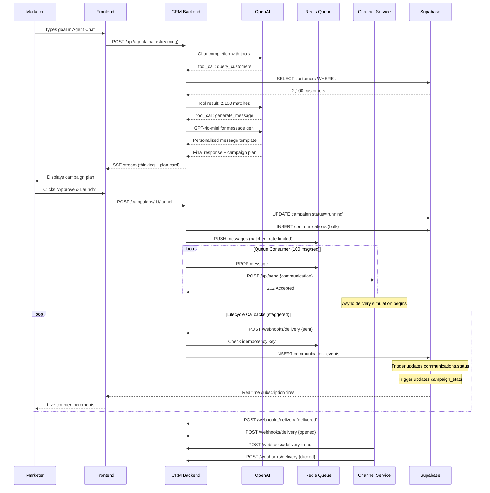
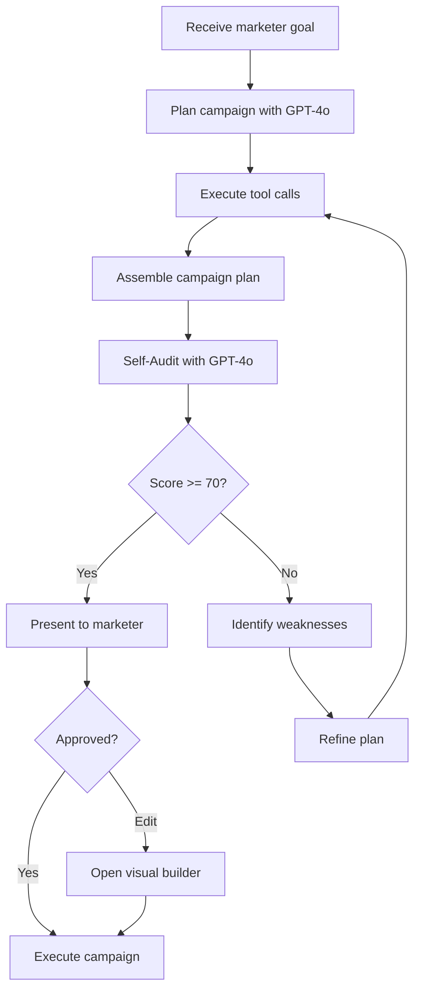
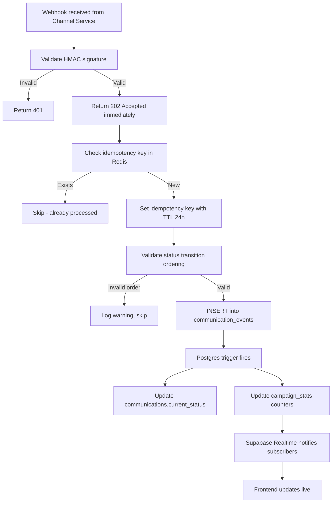
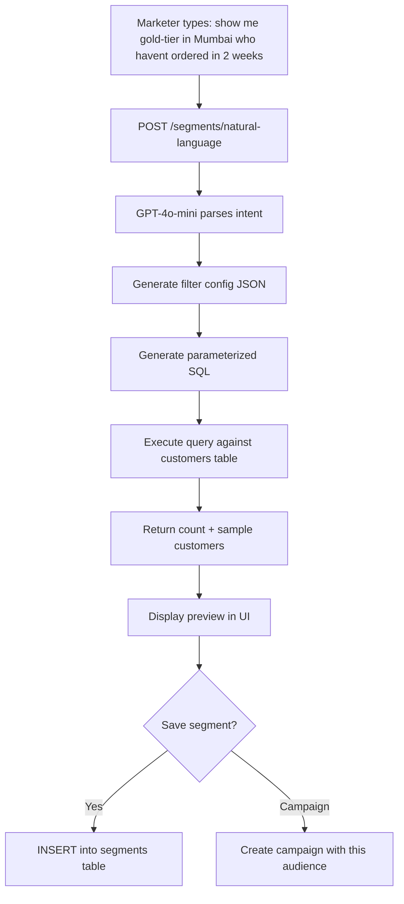
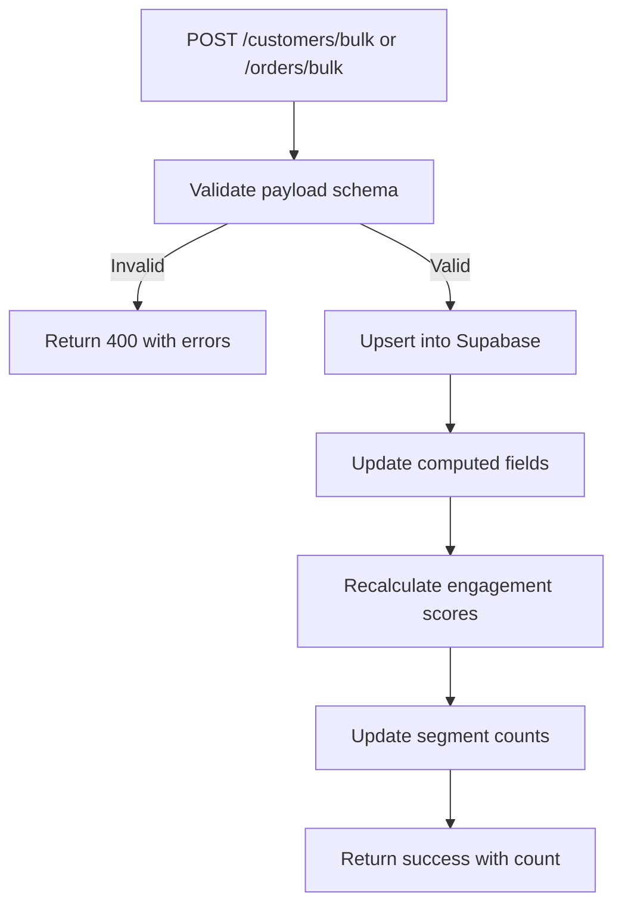
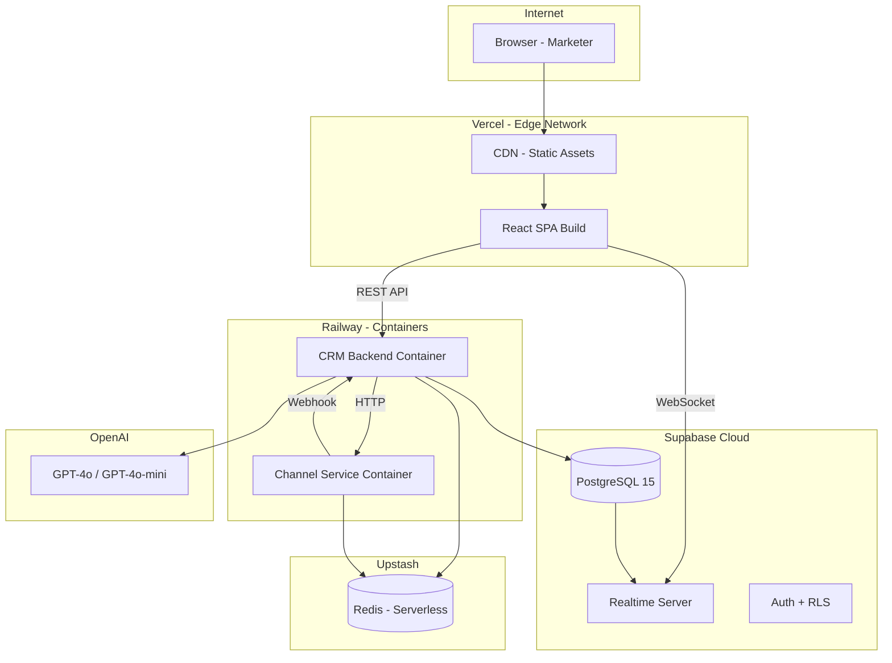
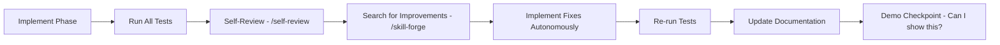

# System Flows

## Flow 1: Campaign Execution (End-to-End)



## Flow 2: AI Agent Self-Correction Loop



## Flow 3: Webhook Processing (Idempotent)



## Flow 4: Natural Language Segmentation



## Flow 5: Data Ingestion



---

# Deployment Architecture

## Infrastructure Diagram



## Environment Configuration

```env
# CRM Backend (.env)
PORT=3001
SUPABASE_URL=https://xxx.supabase.co
SUPABASE_SERVICE_KEY=eyJ...
UPSTASH_REDIS_URL=https://xxx.upstash.io
UPSTASH_REDIS_TOKEN=xxx
OPENAI_API_KEY=sk-xxx
CHANNEL_SERVICE_URL=http://channel-service:3002
WEBHOOK_SECRET=shared-hmac-secret
FRONTEND_URL=https://reach-ai.vercel.app

# Channel Service (.env)
PORT=3002
CRM_WEBHOOK_URL=http://crm-backend:3001/api/webhooks/delivery
WEBHOOK_SECRET=shared-hmac-secret
UPSTASH_REDIS_URL=https://xxx.upstash.io
UPSTASH_REDIS_TOKEN=xxx

# Frontend (.env)
VITE_API_URL=https://crm-backend.railway.app/api
VITE_SUPABASE_URL=https://xxx.supabase.co
VITE_SUPABASE_ANON_KEY=eyJ...
```

---

# Sprint Plan (Execution Order + Testing + Self-Improvement)

## Phase Execution Protocol (MANDATORY after every phase)



### The Loop (Applied After EVERY Phase):
1. **IMPLEMENT** the phase deliverable
2. **TEST** — Run unit tests, integration tests, edge case tests for this phase
3. **SELF-REVIEW** — Re-read every modified file. Check for bugs, edge cases, type safety, error handling, security
4. **SEARCH FOR IMPROVEMENT** — Compare against best-in-class. Ask "what would a staff engineer critique?"
5. **FIX** — Implement top improvements immediately (don't ask, just fix)
6. **RE-TEST** — Ensure improvements didn't break anything
7. **UPDATE DOCS** — Reflect changes in PRD/TRD/ARCHITECTURE.md/SYSTEM-FLOWS.md
8. **CHECKPOINT** — Prove this phase works with evidence (curl output, test results, screenshot)

---

| Phase | Duration | Deliverable | Tests | Exit Criteria |
|-------|----------|-------------|-------|---------------|
| 1 | 3h | Monorepo scaffold, Supabase schema, seed script | Schema validation, seed idempotency, data distribution | `npm run seed` populates 10K customers + 50K orders correctly |
| 2 | 4h | CRM Backend core (CRUD + segments + NL) | 25+ unit tests, pagination perf, SQL injection checks | All endpoints return correct data under <200ms |
| 3 | 3h | Channel Service (full lifecycle sim) | Lifecycle validity, retry logic, idempotency, DLQ | 100 messages sent → all callbacks received → stats accurate |
| 4 | 5h | AI Agent (tools + self-correction + streaming) | 5 demo scenarios pass, error recovery, loop prevention | Agent plans campaign from NL goal with confidence >70 |
| 5 | 3h | Frontend shell + routing + layout + dashboard | All routes render, loading/error states, responsive | All 7 routes render without console errors |
| 6 | 5h | Agent Chat UI (streaming + cards + approval) | Streaming renders, approval flow, error recovery | Full conversation → campaign launch works |
| 7 | 4h | Campaign screens (list + detail + live pulse) | Realtime subscription, funnel accuracy, virtualization | Counters animate live on webhook receipt |
| 8 | 4h | Customer + Segments screens (NL builder) | Table performance, NL parsing, filter correctness | NL segmentation returns correct audience |
| 9 | 3h | Integration, deployment, polish, docs | E2E demo scenarios, deploy smoke tests | Live URL, all 5 demo scenarios work end-to-end |

**Total estimated: ~34 hours (including testing + improvement cycles)**

---

# Technical Risk Analysis

| Risk | Probability | Impact | Mitigation |
|------|:-----------:|:------:|-----------|
| OpenAI rate limit hit during demo | Low | High | Use GPT-4o-mini (high limits), implement response caching for repeated queries |
| Supabase free tier connection limit (50) | Medium | Medium | Use connection pooling via Supabase built-in pooler |
| Upstash Redis 10K cmd/day limit | Medium | Medium | Batch operations, use pipeline commands, keep demo data moderate |
| Railway free tier cold starts | Medium | Low | Keep services warm with health check pings every 5 min |
| Channel service callback timing in demo | Low | Medium | Add "demo mode" with faster simulation (1-5s vs realistic delays) |
| AI agent generates invalid campaign | Medium | Medium | Self-correction loop catches this; fallback to manual builder |
| Webhook loss during high volume | Low | High | Idempotency keys + DLQ + ordered processing |
| Supabase Realtime subscription limits | Low | Medium | Filter subscriptions narrowly, single-row stats pattern |
| Frontend bundle size too large | Low | Low | Code splitting per route, lazy load heavy components |
| TypeScript build errors blocking deploy | Medium | High | CI-free deployment; thorough local testing before push |

---

# Verification Strategies

## Pre-Deployment Checklist

```
□ All API endpoints return expected response shapes
□ Seed script runs without errors and produces realistic data
□ Channel service receives messages and fires callbacks
□ All webhook callbacks are processed (zero data loss)
□ Idempotency: duplicate webhooks don't create duplicate events
□ Status ordering: can't jump from 'sent' to 'clicked'
□ AI agent can complete 3 canonical demo scenarios
□ Self-correction triggers when plan quality is low
□ Realtime: dashboard counters update live during campaign
□ All 7 frontend screens render without errors
□ Mobile responsive: no horizontal overflow on tablet
□ Error states: graceful handling of API failures
□ Environment variables: no secrets in committed code
□ Deployment: both Railway services start and accept traffic
□ Cross-service communication: CRM ↔ Channel verified
```

## Demo Scenarios (Must All Work)

| Scenario | Expected Outcome |
|----------|-----------------|
| "Win back customers who haven't ordered in 30 days" | Agent segments ~3K churning customers, recommends WhatsApp, generates re-engagement offer |
| "Launch our new cold brew to premium customers in Mumbai" | Agent finds gold/platinum tier in Mumbai, multi-channel campaign, product-focused messaging |
| "Send a loyalty reward to our most active customers this month" | Agent identifies top-decile by order frequency, personalized reward message |
| Manual segment creation: "gold tier, Bangalore, last order > 14 days" | NL → filter → preview shows correct count |
| View running campaign | Live funnel updates, communication log populates in real-time |

## Performance Targets

| Metric | Target | How to Verify |
|--------|--------|---------------|
| Dashboard load time | < 1.5s | Browser DevTools Network tab |
| API response (CRUD) | < 200ms | Console log timing |
| AI first token | < 2s | Measure SSE first data event |
| Webhook processing | < 100ms | Server-side timing logs |
| Realtime update latency | < 500ms | Visual inspection during demo |
| Campaign execution (1000 msgs) | < 30s to queue all | Timing from launch to queue-complete |
