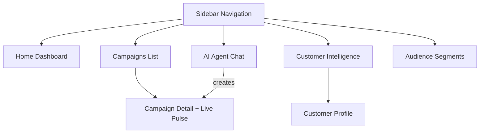

# UX Flows & Component Inventory

## Screen Map



---

## Screen Specifications

### Screen 1: Home Dashboard (`/`)

**Purpose:** At-a-glance health of marketing operations + AI proactive suggestions

**Layout:**
```
┌─────────────────────────────────────────────────────────┐
│ [Sidebar]  │  Welcome back, Priya           [Notifications] │
│            │─────────────────────────────────────────────────│
│ Dashboard  │  ┌────────┐ ┌────────┐ ┌────────┐ ┌────────┐ │
│ AI Agent   │  │ Total  │ │ Active │ │ Sent   │ │ Avg    │ │
│ Campaigns  │  │ Custs  │ │ Camps  │ │ Today  │ │ Dlvry% │ │
│ Customers  │  │ 10,247 │ │   3    │ │ 1,420  │ │ 91.2%  │ │
│ Segments   │  └────────┘ └────────┘ └────────┘ └────────┘ │
│            │─────────────────────────────────────────────────│
│            │  Recent Campaigns          AI Suggestions       │
│            │  ┌──────────────────┐    ┌──────────────────┐  │
│            │  │ Campaign Card    │    │ "312 gold-tier   │  │
│            │  │ with sparkline   │    │  customers show  │  │
│            │  │ and status       │    │  declining visits│  │
│            │  └──────────────────┘    │  — Run win-back?"│  │
│            │  ┌──────────────────┐    │  [Ask AI →]      │  │
│            │  │ Campaign Card    │    └──────────────────┘  │
│            │  └──────────────────┘                           │
└─────────────────────────────────────────────────────────────┘
```

**Components:**
- `MetricCard` — Icon, label, value, trend indicator
- `CampaignMiniCard` — Name, status badge, sparkline, quick stats
- `AISuggestionCard` — Insight text, action button linking to Agent
- `Sidebar` — Navigation with active state, brand logo

---

### Screen 2: AI Agent Chat (`/agent`)

**Purpose:** Primary interaction point. Marketer describes goals, AI plans + executes.

**Layout:**
```
┌──────────────────────────────────────────────────────────┐
│ [Sidebar] │  AI Marketing Agent              [New Chat]   │
│           │──────────────────────────────────────────────  │
│           │  ┌─ Session History ─┐  ┌─ Chat Area ────────┐│
│           │  │ Today             │  │                     ││
│           │  │  • Win back...    │  │  [AI Message]       ││
│           │  │  • Launch new...  │  │  "I'll analyze..."  ││
│           │  │ Yesterday         │  │                     ││
│           │  │  • Loyalty...     │  │  [Thinking Block]   ││
│           │  │                   │  │  ├ Querying custs   ││
│           │  │                   │  │  ├ Found 2,100      ││
│           │  │                   │  │  └ Analyzing...     ││
│           │  │                   │  │                     ││
│           │  │                   │  │  [Campaign Card]    ││
│           │  │                   │  │  ┌───────────────┐  ││
│           │  │                   │  │  │ Audience: 2.1K│  ││
│           │  │                   │  │  │ Channels: WA+ │  ││
│           │  │                   │  │  │ Confidence:87%│  ││
│           │  │                   │  │  │[Approve][Edit]│  ││
│           │  │                   │  │  └───────────────┘  ││
│           │  └───────────────────┘  │                     ││
│           │                         │  ┌─────────────────┐││
│           │                         │  │ Type a goal...  │││
│           │                         │  └─────────────────┘││
│           │                         └─────────────────────┘│
└──────────────────────────────────────────────────────────┘
```

**Components:**
- `ChatMessage` — User or AI message bubble with timestamp
- `ThinkingBlock` — Collapsible block showing agent tool calls + results
- `ToolCallCard` — Individual tool invocation with name, params, result summary
- `CampaignPlanCard` — Inline campaign preview with audience, channels, message, confidence
- `ApprovalButtons` — "Approve & Launch" (green) + "Edit in Builder" (outline)
- `ChatInput` — Text input with send button, suggested prompts on empty state
- `SessionList` — Sidebar of past conversations, grouped by date
- `StreamingIndicator` — Animated dots while AI is generating

---

### Screen 3: Campaigns List (`/campaigns`)

**Purpose:** View all campaigns, their status, and quick performance.

**Layout:**
```
┌──────────────────────────────────────────────────────────┐
│ [Sidebar] │  Campaigns                [+ Create with AI]  │
│           │────────────────────────────────────────────────│
│           │  Filters: [All ▾] [Channel ▾] [Date Range]    │
│           │────────────────────────────────────────────────│
│           │  ┌──────────────────────────────────────────┐ │
│           │  │ Monday Morning Boost      🟢 Running      │ │
│           │  │ WhatsApp • 1,200 sent • 89% delivered    │ │
│           │  │ ████████████░░░ 78% complete              │ │
│           │  └──────────────────────────────────────────┘ │
│           │  ┌──────────────────────────────────────────┐ │
│           │  │ Loyalty Tier Upgrade       ✅ Completed    │ │
│           │  │ Email • 3,400 sent • 91% delivered       │ │
│           │  │ Open: 34% • Click: 12%                   │ │
│           │  └──────────────────────────────────────────┘ │
│           │  ┌──────────────────────────────────────────┐ │
│           │  │ Weekend Brunch Special     ❌ Failed       │ │
│           │  │ RCS • 500 sent • 62% delivered           │ │
│           │  │ Error: High failure rate (38%)            │ │
│           │  └──────────────────────────────────────────┘ │
└──────────────────────────────────────────────────────────┘
```

**Components:**
- `CampaignCard` — Full-width card with status, channel, progress bar, metrics
- `StatusBadge` — Color-coded status indicator
- `ProgressBar` — Animated fill showing completion percentage
- `FilterBar` — Dropdowns for status, channel, date range
- `EmptyState` — "No campaigns yet — ask AI to create one"

---

### Screen 4: Campaign Detail (`/campaigns/:id`)

**Purpose:** Deep-dive into a single campaign with real-time delivery tracking.

**Layout:**
```
┌──────────────────────────────────────────────────────────┐
│ [Sidebar] │  ← Campaigns / Monday Morning Boost          │
│           │────────────────────────────────────────────────│
│           │  Status: 🟢 Running    Channel: WhatsApp      │
│           │  Goal: "Re-engage morning regulars"           │
│           │────────────────────────────────────────────────│
│           │  ┌── Delivery Funnel (Live) ──────────────┐   │
│           │  │  Sent    Delivered  Opened  Read  Click │   │
│           │  │  1,200    1,140      855    684   274   │   │
│           │  │  ████     ████      ████   ███   ██    │   │
│           │  │  100%     95%       75%    60%   24%   │   │
│           │  └────────────────────────────────────────┘   │
│           │────────────────────────────────────────────────│
│           │  AI Insight: "WhatsApp delivered 23% faster    │
│           │  than your last SMS campaign to this segment"  │
│           │────────────────────────────────────────────────│
│           │  Communications Log                           │
│           │  ┌─────────┬──────────┬─────────┬──────────┐ │
│           │  │Customer │ Channel  │ Status  │ Timeline │ │
│           │  │Rahul S. │ WhatsApp │ ✅ Read │ ●●●●○    │ │
│           │  │Priya M. │ WhatsApp │ 📨 Dlvd │ ●●●○○    │ │
│           │  │Amit K.  │ WhatsApp │ ❌ Fail │ ●○○○○    │ │
│           │  └─────────┴──────────┴─────────┴──────────┘ │
└──────────────────────────────────────────────────────────┘
```

**Components:**
- `DeliveryFunnel` — Animated bar chart showing live counts (Framer Motion)
- `FunnelStage` — Individual stage with count, percentage, animated counter
- `AIInsightBanner` — Generated insight with icon
- `CommunicationTable` — Paginated table with status icons and mini timeline
- `StatusTimeline` — Dot visualization showing how far through lifecycle
- `CampaignHeader` — Status, channel, goal, dates

---

### Screen 5: Customer Intelligence (`/customers`)

**Purpose:** Explore customer base, understand segments, find opportunities.

**Components:**
- `CustomerTable` — Virtual-scrolled table with search, sort, filter columns
- `LoyaltyBadge` — Colored tier badge (bronze/silver/gold/platinum)
- `SegmentTag` — Clickable tag showing segment membership
- `EngagementGauge` — Mini gauge showing engagement score
- `QuickFilter` — Preset filter buttons (Active, Churning, High-value, New)
- `CustomerSlideOver` — Side panel with profile preview on row click

---

### Screen 6: Customer Profile (`/customers/:id`)

**Purpose:** Full customer journey and history.

**Components:**
- `ProfileHeader` — Name, tier, engagement score, preferred channel
- `OrderTimeline` — Chronological order history with items and amounts
- `CommunicationHistory` — All campaigns received + their delivery status
- `EngagementBreakdown` — Radar chart of engagement dimensions
- `AIPrediction` — "Likely to churn in 7 days" or "High upsell potential"
- `QuickAction` — "Send personalized message" button

---

### Screen 7: Audience Segments (`/segments`)

**Purpose:** Create, manage, and explore audience segments.

**Components:**
- `SegmentCard` — Name, description, customer count, last used date
- `NLSegmentInput` — Natural language input that generates filter config
- `VisualFilterBuilder` — AND/OR condition builder with attribute dropdowns
- `AudiencePreview` — Count + demographic breakdown of matched customers
- `SegmentOverlap` — Visual showing overlap between 2 selected segments
- `ActionButtons` — "Save Segment" + "Campaign this Segment"

---

## Complete Component Inventory

### Layout Components
| Component | Props | Used In |
|-----------|-------|---------|
| `AppShell` | children | All pages |
| `Sidebar` | currentPath, collapsed | All pages |
| `PageHeader` | title, breadcrumbs, actions | All pages |
| `SlideOver` | open, onClose, children | Customers |

### Data Display
| Component | Props | Used In |
|-----------|-------|---------|
| `MetricCard` | icon, label, value, trend, trendDirection | Dashboard |
| `DataTable` | columns, data, pagination, sorting | Customers, Communications |
| `StatusBadge` | status, size | Campaigns, Communications |
| `LoyaltyBadge` | tier | Customers |
| `ProgressBar` | value, max, animated | Campaigns |
| `Sparkline` | data, color, width, height | Dashboard, Campaigns |
| `FunnelChart` | stages, animated | Campaign Detail |

### AI Agent
| Component | Props | Used In |
|-----------|-------|---------|
| `ChatMessage` | role, content, timestamp | Agent Chat |
| `ThinkingBlock` | steps, expanded | Agent Chat |
| `ToolCallCard` | tool, params, result, duration | Agent Chat |
| `CampaignPlanCard` | campaign, onApprove, onEdit | Agent Chat |
| `StreamingText` | content, isStreaming | Agent Chat |
| `ChatInput` | onSend, placeholder, suggestions | Agent Chat |
| `SessionList` | sessions, activeId, onSelect | Agent Chat |

### Campaign
| Component | Props | Used In |
|-----------|-------|---------|
| `CampaignCard` | campaign, onClick | Campaigns List |
| `DeliveryFunnel` | stats, animated, realtime | Campaign Detail |
| `CommunicationRow` | communication, showTimeline | Campaign Detail |
| `AIInsightBanner` | insight, type | Campaign Detail |

### Segments
| Component | Props | Used In |
|-----------|-------|---------|
| `NLSegmentInput` | onGenerate, loading | Segments |
| `FilterBuilder` | filters, onChange | Segments |
| `FilterCondition` | field, operator, value, onRemove | Segments |
| `AudiencePreview` | count, breakdown | Segments |

### Shared/Common
| Component | Props | Used In |
|-----------|-------|---------|
| `Button` | variant, size, loading, icon | Everywhere |
| `Input` | type, placeholder, error | Forms |
| `Select` | options, value, onChange | Filters |
| `Modal` | open, title, onClose, children | Confirmations |
| `Toast` | message, type, duration | Notifications |
| `Skeleton` | width, height, rounded | Loading states |
| `EmptyState` | icon, title, description, action | Empty lists |
